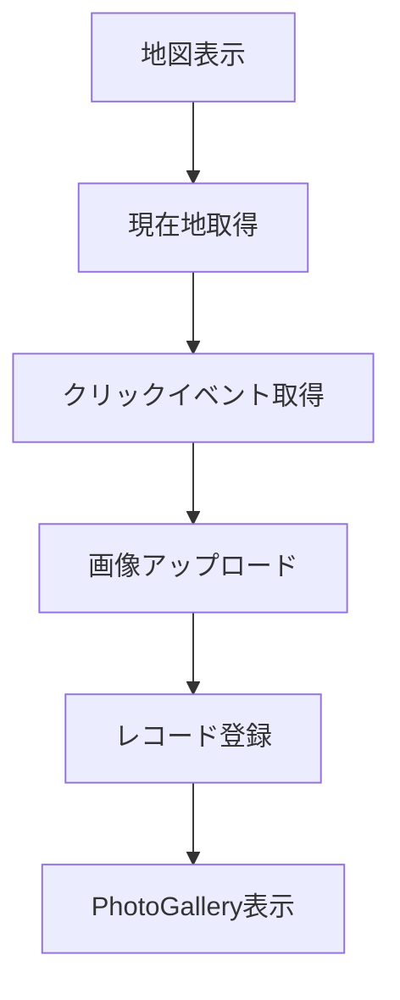

# SnapMap
https://snap-map-eight.vercel.app/
> Google Maps  × Photo Memories — 地図上に自分の思い出を残せるアプリ  

---

## Overview

**SnapMap** は、地図上の任意の場所に写真とメモを記録できるアプリケーションです。  
旅行や日常の記録を、位置情報とともにビジュアルに残せる体験を目指しています。  

| 地図クリックで登録 | ギャラリー管理 | 現在地取得 |
|---------------------|----------------|----------------|
| 画像アップロードと位置保存 | 登録済み写真を一覧表示 | 自分の現在地をワンクリックで表示 |

---

## Features

-  **Google Maps API連携** — マップ上でピン操作可能  
-  **現在地取得機能** — `Geolocation API`を利用  
-  **画像アップロード & プレビュー機能** — ドラッグ＆ドロップ対応  
-  **カスタムフック設計** — 再利用性の高いロジック分離  

-  **Honoを使用してバックエンドを開発し、データの永続化を予定
---

## Architecture

| 層 | 内容 |
|----|------|
| フロントエンド | Vite + React + TypeScript |
| 状態管理 | React Hooks（useRecords, useFilePreviewsなど） |
| スタイル管理 | CSS Modules / TypeScript Style Object |
| API | Google Maps JavaScript API |

---

## Custom Hooks

| Hook名 | 役割 |
|--------|------|
| `useMapApiLoader` | Google Mapsスクリプトの非同期ロード |
| `useCurrentPosition` | 現在地を取得しマップへ反映 |
| `useRecords` | ユーザーが登録した写真レコードの管理 |
| `useFilePreviews` | 画像ファイルのプレビュー生成 |

---

## Main Components

| コンポーネント | 機能概要 |
|----------------|-----------|
| `SnapMapPage` | アプリ全体の画面構成を管理 |
| `MapView` | Google Map表示・クリック位置取得 |
| `ImageUploader` | 画像アップロードとプレビュー |
| `PhotoGallery` | 登録済み写真の一覧表示 |

---

## Development Flow

